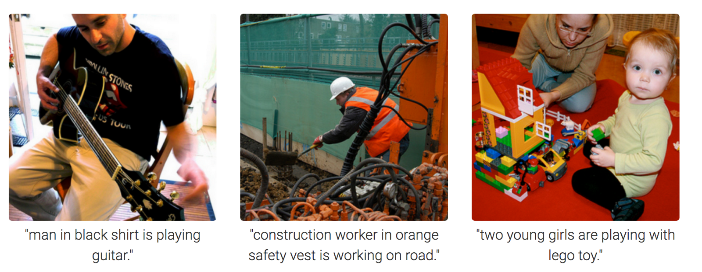

# Project 5: Free-Topic Final Project

### [Project Description](doc/project5_desc.md)


[Credit:](https://towardsdatascience.com/image-captioning-in-deep-learning-9cd23fb4d8d2)

Term: Spring 2022

+ Team: Group 7
+ **Projec title**: Image Captioning with Conditioned LSTM Generators
+ Team members
	+ team member 1: He, Lichun (lh3094@columbia.edu)
	+ team member 2: Tang, Shiqi (st3349@columbia.edu)
	+ team member 3: Zeng, Shanyue (sz2896@columbia.edu)
	+ team member 4: Wang, Huiying (hw2816@columbia.edu)
	+ team member 5: Jiuru, Wang (jw4150@columbia.edu)
+ **Project summary**: 
	+ Image captioning is an interesting problem, which combines both computer vision techniques and natural language processing techniques. In this project, we will create an image caption generation model using [Flicker 8K data](https://forms.illinois.edu/sec/1713398). This model takes a single image as input and output the caption to this image.
	+ We implemented different techniques to extract features: Inception V3, InceptionResNetV2 and VGG16.
	+ To evaluate the model performance,  we used bilingual evaluation understudy BLEU. 

+ **Contribution statement**: ([default](doc/a_note_on_contributions.md)) 
	+ All team members attended all the meetings and designed the study together.
	+ Lichun He and Shiqi Tang studied, implemented and evaluated the LSTM model with Inception V3 pre-trained model.
	+ Shanyue Zeng, Huiying Wang and Jiuru Wang studied, implemented and evaluated the LSTM model with Inception V2.
	+ Shiqi Tang implemented and evaluated the model which extracts features from images using VGG-16.
	+ All team members helped in preparing the presentation slides.
	+ Shiqi Tang presented the project.
	+ All team members approve our work presented in this GitHub repository including this contributions statement. 


Following [suggestions](http://nicercode.github.io/blog/2013-04-05-projects/) by [RICH FITZJOHN](http://nicercode.github.io/about/#Team) (@richfitz). This folder is orgarnized as follows.

```
proj/
├── lib/
├── data/
├── doc/
├── figs/
└── output/
```

Please see each subfolder for a README file.
